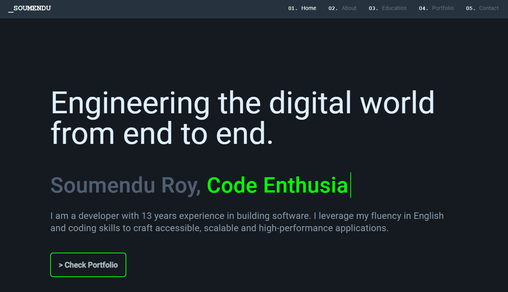

# BC | Angular Portfolio App

This is my personal portfolio website built with Angular, Typescript, HTML5, CSS3, Bootstrap, Ngx-Bootstrap, DevIcons and Angular Material. It's currently deployed on the web: [https://angular-portfolio-app-omega.vercel.app/](https://angular-portfolio-app-omega.vercel.app/)

This project was generated with [Angular CLI](https://github.com/angular/angular-cli) version 18.3.7.

## Author

I'm Soumendu Roy, a software developer.

- [Github](https://github.com/soumendu-git)
- [Linkedin](https://www.linkedin.com/in/soumendu-roy-03a8688?lipi=urn%3Ali%3Apage%3Ad_flagship3_profile_view_base_contact_details%3BMTaMfkWsTfue1RcDo5uuug%3D%3D)
- [Twitter](https://x.com/soumenduroy2002)

## The Project

This portfolio is a **dynamic and responsive web application** built using **Angular**, showcasing my skills and projects as a software developer. The design and development of this portfolio aimed to provide a seamless user experience across different devices while highlighting various aspects of my professional journey. 

The potfolio has sections of home, about, education, portfolio projects and contact information. Key features are its dynamic content, the responsive design and modern aesthetics.

## Technologies Used

- AngularCLI
- Angular
- Angular Materials
- Typescript
- HTML5
- CSS3
- Bootstrap
- Ngx-Bootstrap
- Dev Icons
- Vercel
- Vite

## Development server

You can run this project locally too.

Clone this repo.

Run `ng serve` for a dev server. 

Navigate to `http://localhost:4200/`. 

The application will automatically reload if you change any of the source files.

## Code scaffolding

Run `ng generate component component-name` to generate a new component. You can also use `ng generate directive|pipe|service|class|guard|interface|enum|module`.

## Build

Run `ng build` to build the project. The build artifacts will be stored in the `dist/` directory.

## Further help

To get more help on the Angular CLI use `ng help` or go check out the [Angular CLI Overview and Command Reference](https://angular.io/cli) page.

## About

This portfolio was designed and developed by myself, Barbara Calderon, using frontend software skills for a dynamic and responsive web application.